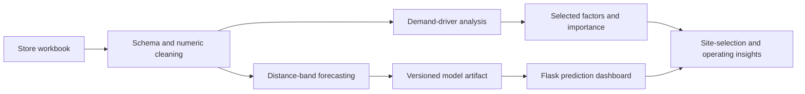

# Xiaoxiang Supermarket Store Analytics

**Store demand-driver analysis, distance-band order forecasting, and a local decision dashboard**

- **Project period:** March–June 2025
- **Context:** Meituan business-topic project
- **Repository maintainer and release curator:** Zihan Shen

This project studies store-location and operating decisions for Xiaoxiang Supermarket through multidimensional data mining and machine learning. It connects three tasks: identifying demand drivers, predicting M12 daily orders across five delivery-distance bands, and exposing the forecast through a lightweight web interface.

This is an independent project showcase. It is not an official Meituan repository, production service, or endorsement.

## Project highlights

- **Business-aware feature system:** organizes candidate drivers around user coverage, user activity, residential/work scenarios, user value, and local competition.
- **Small-sample model selection:** compares random forest and gradient boosting with leave-one-out cross-validation after IQR outlier filtering and univariate feature selection.
- **Distance-aware demand forecasting:** trains five XGBoost regressors for orders within `<1.5 km`, `1.5–2.1 km`, `2.1–2.8 km`, `2.8–3.8 km`, and `>3.8 km`.
- **End-to-end artifact flow:** persists preprocessing and models together, then loads the versioned artifact in a Flask application factory.
- **Release hardening:** removes local Windows paths, prevents training at import time, fits preprocessing on training data only, validates workbook schemas, and disables Flask debug mode by default.

## Questions addressed

### 1. What drives store-level order volume?

The main analysis removes distance-band order targets from the candidate predictors, applies IQR filtering to the total-order target, selects up to ten features, and compares random forest with gradient boosting under leave-one-out cross-validation. A broader random-forest baseline is retained as a separate diagnostic rather than being presented as a duplicate implementation.

### 2. How are M12 orders distributed by delivery radius?

The forecasting task independently models five distance bands with XGBoost and sums their rounded predictions into a total daily-order estimate. This decomposition makes the output more useful for delivery-radius and fulfillment discussions than a single total alone.

### 3. How can a user inspect a candidate store?

The dashboard accepts coverage, active-user, value-segment, scenario, and competition indicators. It loads the exact scaler, feature order, targets, and five models saved during training.



## Findings recorded in the project report

The source report identifies residential active-user share, households in the 2.1–2.8 km band, mixed residential/work active-user share, households within 1.5 km, and work-only active-user share among the leading store-demand factors. It also records an overall XGBoost test MSE of **2600.403** for the distance-band prediction task.

These are **report-reported findings**, not newly reproduced results. The source workbook was not included with the supplied code, so this repository does not claim an independent numerical reproduction. Feature importance describes predictive association and should not be interpreted as a causal effect.

## Repository structure

```text
.
├── xiaoxiang_analytics/
│   ├── data.py                    # workbook validation and numeric parsing
│   ├── demand_drivers.py          # RF/GB comparison and RF baseline
│   ├── distance_forecasting.py    # five XGBoost models and artifact I/O
│   ├── webapp.py                  # Flask application factory
│   └── templates/                 # input and result pages
├── scripts/
│   ├── analyze_store_demand_drivers.py
│   ├── rank_store_feature_importance.py
│   ├── train_distance_band_order_forecaster.py
│   └── serve_order_prediction_dashboard.py
├── data/README.md                 # expected private-data layout
├── docs/CODE_SCOPE.md             # original-to-release file mapping
└── tests/                         # synthetic-data and web smoke tests
```

## Installation

Python 3.10 or newer is recommended.

```bash
git clone https://github.com/Ailta666508/Xiaoxiang-Store-Analytics.git
cd Xiaoxiang-Store-Analytics
python -m venv .venv
source .venv/bin/activate
python -m pip install -e '.[dev]'
```

## Data setup

The private source workbook is not included. Use a copy you are authorized to access and place it outside version control, for example:

```text
data/store_features.xlsx
```

The original scripts read worksheet `Sheet2`. Required columns and input conventions are documented in [`data/README.md`](data/README.md).

## Usage

### Analyze store demand drivers

```bash
analyze-store-demand-drivers \
  --data data/store_features.xlsx \
  --sheet Sheet2 \
  --output-dir results/demand-drivers
```

### Run the broad random-forest baseline

```bash
rank-store-feature-importance \
  --data data/store_features.xlsx \
  --sheet Sheet2 \
  --output-dir results/baseline
```

### Train distance-band forecasting models

```bash
train-distance-band-forecaster \
  --data data/store_features.xlsx \
  --sheet Sheet2 \
  --output-dir results/forecast
```

### Start the local dashboard

```bash
serve-order-prediction-dashboard \
  --model results/forecast/distance_order_forecaster.joblib
```

Then open `http://127.0.0.1:5000`. The server binds only to localhost by default.

## Validation

The repository includes synthetic-data tests so the code path can be checked without publishing business data:

```bash
python -m pytest -q
python scripts/verify_release.py
```

The test suite covers IQR filtering and model comparison, the random-forest baseline, XGBoost multi-target training, artifact round-tripping, single-store prediction, and both Flask routes. See [`docs/VALIDATION.md`](docs/VALIDATION.md) for the tested environment and results.

## Limitations

- The original workbook is unavailable in this release, so report metrics and rankings cannot be independently reproduced here.
- Small datasets make holdout metrics unstable; leave-one-out cross-validation reduces wasted samples but does not remove sampling uncertainty.
- Impurity-based random-forest importance can favor high-cardinality or continuously valued features.
- Five independently trained distance models do not enforce cross-band consistency beyond non-negative rounded outputs.
- The dashboard is a local prototype. It does not provide authentication, production deployment, monitoring, or database integration.

## Authorship and contribution

The source report presents the work under the team name **Meishu Zhixing (美数智行)** and does not provide a complete individual author list. **Zihan Shen** maintains and curated this public code release. GitHub's contributor list reflects commit authorship for this repository and should not be interpreted as sole authorship of the original team project.

No open-source license is granted by this repository. Please contact the relevant project rights holders before reusing the code. Meituan and Xiaoxiang Supermarket names and marks belong to their respective owners.

**Note:** This project was initially developed locally. The Git repository was created when the codebase was prepared for publication, so the early development history is unavailable. Subsequent updates are tracked in this repository.
